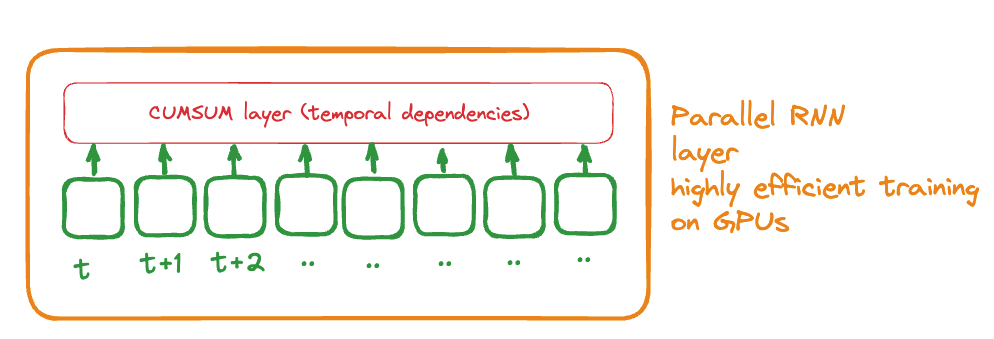

# parralel_RNN

testing ideas on how to accelerate RNN with better architecture

The basic idea is to use a cumsum layer as the layer to represent the temporal dependencies instead of a recurring architecture that depend on the previous temporal step to be compute.

The key idea is to increase greatly the neural network speed